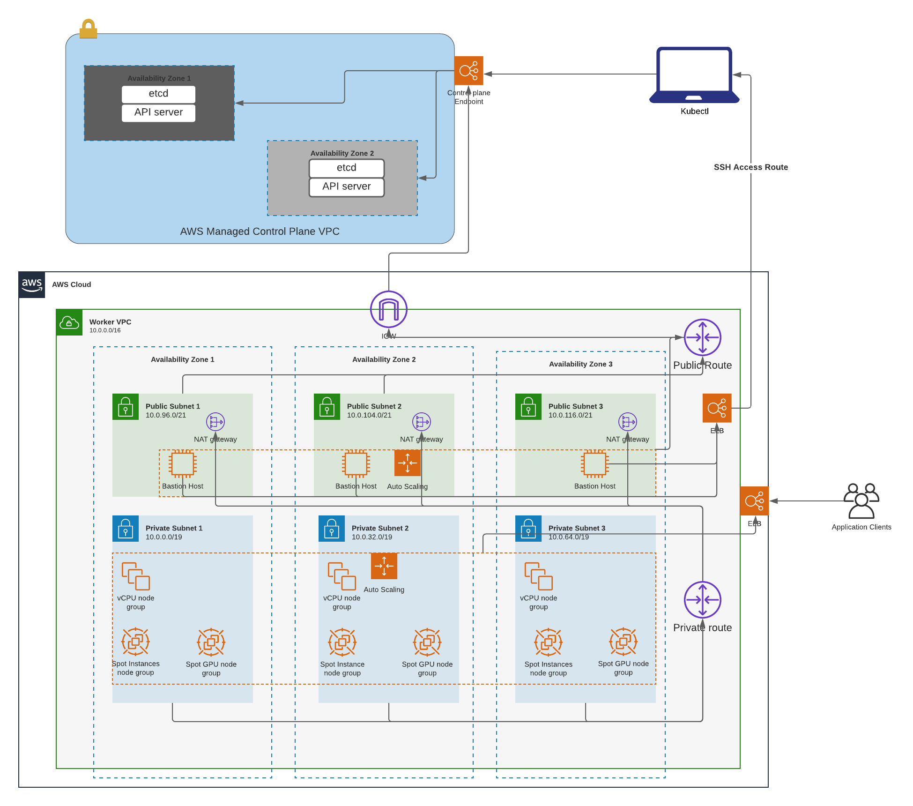

# infrastructure

 Cloud Kubernetes Cluster Infrastructure

## bootstrapping AWS Account

This repo utilizes remote tracking of terraform state file. Before deploying any modules into any account you want to first setup the backend infrastructure for tracking state file. To do so follow the following instructions:

- `cd backend` directory
- Make a copy of the `example-account` directory and rename your copy to your account name
- Open up your newly created dirctory
- Update the `main.auto.tfvars` file with the required information
- create a local file named `terraform.tfvars` in the same directory
    copy and paste the following  values:
    - on the first line add `email = "<specify email address>"`
    - on the second line add `name = "<first and last name>"`
- run `terraform init` to initialize your directory and then `terraform plan` to get a plan of the changes that terraform will run
- to apply these changes run a `terraform apply` and then terraform will create an s3 bucket for storing your state file **(<bootstrap_account>-<bootstrap_region>-terraform-state)**, a second s3 bucket for logging **(<bootstrap_account>-<bootstrap_region>-terraform-state-logs)** and a dynamo db table for locking statefile in s3 bucket
- Rename your generated state file (`terraform.tfstate`) in your created directory by appending the end with `_backend` and commit to source control for tracking.

Take note of the name of the s3 bucket as you will need to provide this bucket name for the backend block when running terraform against your target account. 

[FOR THIS SECTION IS THE ASSUMPTION THAT THEY ARE LOGGED INTO THEIR AWS ACCOUNT AND THAT CONTEXT IS SET?
ALSO THE ASSUMPTION IS THAT TEAMS UPDATE THEIR INFORMATION HERE, BUT HAS THAT BEEN HAPPENING
IN PRACTICE?]

## Infra-diagram

High level AWS infratruture diagram:

## Per team resource

[I looked through this and I feel like we need to either add examples of the resources defined here
or I am missing something about how this connects to the modules and templates section below.
For example what is eks deploy versus k8s?]

`team/team name/envs` should contain tf resources that are going to be associated to specific teams in their **environments** and **regions**. Work in specified directory when building and modifying resources. 
- follow structure for `/teams/example/` directory when building out templates. 

## Using defined modules

[When should these modules be used relative to the above. Are the below ordered in a logical fashion?]

A list of modules have been made available that can be used in your deployment templates.
- **bootstrap module:** for setting up backend componets to store and track statefiles of terraform deployment.
- **vpc and subnet modules:** These modules deploys the underline networking components  that the cluster will be deployed into. 
- **eks_cluster module:** creates an eks cluster with its associated resources like aws security group, cluster role and policies. should be used with eks_node_group and/or eks to deploy node groups with cluster. 
- **eks_node_group module:** creates a nodegroup and its associated resources should be used with "eks_cluster module" to deploy cluster and node group. 
- **eks:** standalone eks node groups can be used in conjuction with terraform `count` function to deploy multimple node groups at the same time. Should use together with "eks_cluster" and "eks_node_group" modules. 

## Deploying tf templates

[Perhaps this is a Tf newb question, but how do templates relate to modules? Similar to the above
when do i use templates relative to the above.]

Sample tf templates have been provided in `test-script` for use

- **eks_deploy:** Creates a complete eks deployment - vpcs, subnets, cluster, node groups etc.
- **networking:** Creates the networking layer - vpc, subnets, igw, Nat gatways, routing tables etc.
- **existing_vpc_deploy:** Creates an EKS cluster on top of an existing network infrastructure - this can be used when you have existing vpc and subnets in place and just need the eks deployed into it.
- **eks_multi_ng_deploy:** Creates a complete eks deployment with 2 different  node groups - vpcs, subnets, cluster, node group1 and node group 2. Handy when deploying 2 sepearate types of nodes eg. vcpu and gpu.
- **k8s-deploy:** deploys cluster autoscaler into created eks cluster to handle automatic scalling of the cluster node to mach resourece requests.
- **s3 bucket:** Creates a sample s3 bucket with logging enabled. 

## Deploying a complete EKS cluster

<!--[Given this is the most important step, it feels light on documentation. Perhaps because it was at the end
there was some writers exhaustion :) ]
[This section feels like it could benefit from a simple visual showing the relationship between templates, modules, and teams directory ] -->

To deploy a complete eks cluster plus networking components [via the modules?] in your account follow the steps below:
- `cd ./test-script/eks_deploy/`
- Copy the contents in this directory
- In the "teams" directory create a directory structure like `/teams/example/envs-region`
- Paste copied files in this directory
- Open "main.tf" and update the modules source path: eg. `source = "../../../modules/vpc"`
- In "network.auto.tfvars" update the variable in there as well as the "variables.tf (if necessary)" files.
- Update backend.tf with information gotten from bootstrapping your account. 
- After updating all variable run `terraform plan` to plan out the changes
- Then `terraform apply` to apply changes, complete eks deployment takes about 15mins - 40mins to complete.
